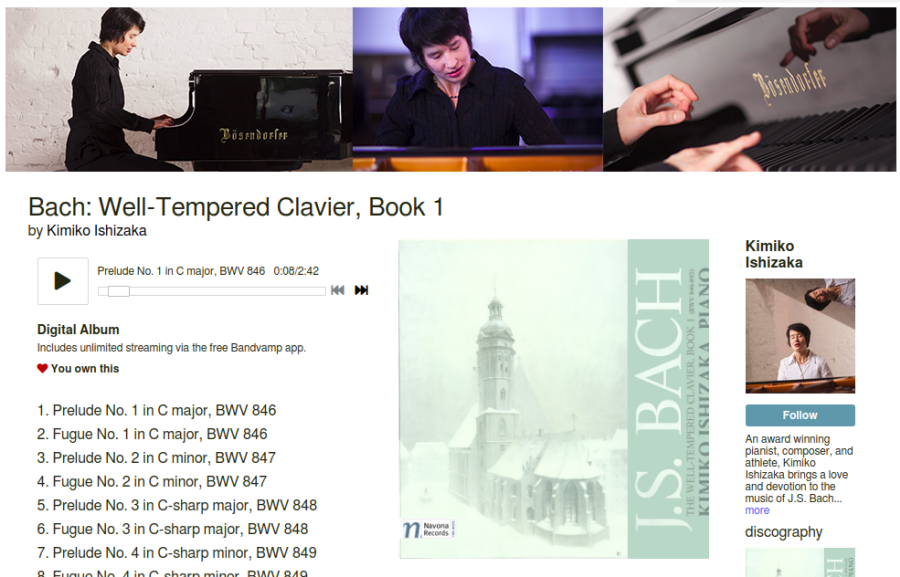

# Bandvamp 

Bandvamp, a bandcamp clone, is a music application that allows users to share original work. 

[Live Demo](https://bandvamp.herokuapp.com)

## Technologies
* Backend: Rails/ActiveRecord/PostgreSQL
* Frontend: React/Redux


## Features
### User Authentication
The app has secure user authentication, using Rails and BCrypt. 
A user can sign up as an artist or a fan. The 'sign up' button in the header brings up a modal, rather than making the user leave whatever page they're visiting.

### Splash Page

The splash page has 3 designed sections of images linking to album pages, including a dynamic carousel which simulates the "Selling Right Now" feature of the original site (bandcamp).

 #### "Selling Right Now" Carousel

The animation of the carousel is done by setting the left-most album to have zero width and using a CSS transition,

```css
transition: width .3s ease-out;
```
In this simulation, a full list of albums is prop-threaded to the React component and shuffled:

```javascript
class SellingNow extends React.Component {
constructor(props) {
    super(props);
    this.allAlbums = props.albums.slice().sort( () => Math.random() - .5);
```

Then by repeatedly calling setTimeout with randomized time durations, the list of displayed albums is updated by way of updating their starting index (this.state.idx) within this.allAlbums:

```javascript
rotate(){
    let {idx} = this.state;
    let timeGap = Math.random()*3;
    this.setState({idx: idx - 1, timeGap},
        () => {
            this.intervalId = setTimeout(()=>this.rotate(), timeGap * 1000)});
}
```

Notice also that hovering over the carousel pauses the animation, but when the mouse leaves the displayed times have updated appropriately.


### Artist Page

A user who is signed up as an artist is assigned an artist page, which displays their albums and allows all users to find (via the search bar) and play their music. 



#### Music Player

The music player is built from scratch, with regards to the look, and the functionality of the slider (which can be dragged along the progress bar).

```javascript
sliderClick(e){
    this.app.addEventListener('mousemove', this.handleMouseMove);
    this.app.addEventListener('mouseup', this.handleMouseUp);
  }

  handleMouseMove(e){
    const pbc = document.getElementById('progress-bar-container');
    const sliderPosition = Math.min(e.clientX - pbc.offsetLeft, 
    this.progBarWidth - this.sliderWidth); 
    this.setState({sliderPosition, handlingMouseMove: true});
  }
```

#### Album/track selection

The user can select an album from the 'discography' section; or a track via the links below the music player. A track selected by the user will be set to play automatically, by way of a callback passed to the setState function: 

```javascript
songClick(idx){
        this.setState({currentTrackNumber: idx + 1},
           () => this.musicPlayer.current.play());
    }
```

#### Purchase album and follow artist
If the user is not logged in, or has not purchased the given album, there is a 'Buy Digital Album' link in the left column, which will add the album to the [user's collection](#collection) (or prompt the user to sign up/ login, if they are not logged in). The right column, below the artist's band name, has a button allowing the user to follow or unfollow the artist (see [Follows](#follows)).

### User Page

The User Page contains a bio section and a tabbed lower section with the user's album collection and followed artists. When logged in, the user can navigate to their user page via the colored nav button at the right end of the header.

#### Collection
The Collection tab contains the user's purchased albums (linking to the corresponding Artist Page, with correct album selected), which by definition have been 'purchased' by the user at an Artist Page.


#### Follows
The Follows tab contains the artists the user is following. The user can always unfollow an artist, from here or the artist's page. Notice that when the user unfollows an artist here, the item does not vanish (until the user refreshes the page, or navigates away and comes back); thus in case of an accidental unfollow, the user can click 'Follow' to reverse their action.

This 'persistence' of follow items is accomplished by allowing local state to dictate the follow items, rather than the Redux state which is updated immediately when the user follows or unfollows an artist.


